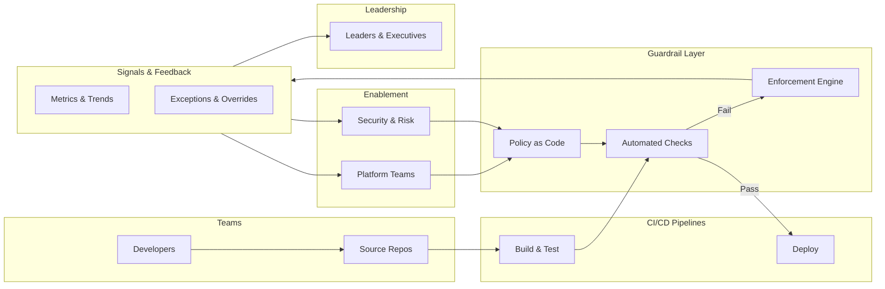

# Platform CI/CD Guardrails — System Map

This diagram shows how CI/CD guardrails operate as a **system**, not a pipeline feature.

It emphasizes:
- Responsibility boundaries
- Signal flow
- Decision ownership

---

## How to Read This Diagram

This diagram represents the **logical flow of CI/CD guardrails**, not a specific toolchain or implementation.

It is intended to help readers understand:
- **Where guardrails live**
- **When they are evaluated**
- **Who owns decisions at each stage**
- **How feedback flows back to teams and leaders**

Read the diagram **left to right**, following the lifecycle of a change from commit to deployment.

---

### 1) Developer & Code Layer

This is where work begins.

- Developers create or modify code
- Changes are committed to version control
- No guardrails are enforced at this stage beyond local tooling

**Key idea:** Guardrails should **not interfere with developer flow** at creation time.

---

### 2) CI Pipeline Layer

This is the first enforcement boundary.

Typical activities include:
- Build
- Test execution
- Static analysis
- Dependency scanning

Guardrails at this layer should be:
- **Automated**
- **Fast**
- **Actionable** (clear remediation)

**Failure behavior:** Most controls should start as **advisory** and mature to gating only once stable.

---

### 3) Policy & Guardrail Evaluation Layer

This layer evaluates rules **independently of pipeline logic**.

Responsibilities include:
- Policy evaluation
- Threshold checks
- Risk classification
- Context-aware decisions (environment, risk tier)

**Important distinction:**
- Pipelines *execute steps*
- Guardrails *evaluate outcomes against policy*

This separation enables:
- Reuse across repositories
- Central policy evolution
- Consistent enforcement

---

### 4) Signal & Feedback Layer

This layer converts guardrail outcomes into **signals**, not punishments.

Signals may include:
- Pass/fail/warn outcomes over time
- Exception / override frequency
- “Noisy rule” indicators (false positives)
- Time-to-remediation trends

These signals feed:
- Team dashboards (local improvement)
- Enablement dashboards (platform investment)
- Leadership dashboards (system constraints)

**Key idea:** This layer exists to **inform decisions**, not to blame teams.

---

### 5) Deployment & Runtime Layer

Deployment proceeds based on:
- Guardrail outcomes
- Risk posture
- Environment sensitivity

Possible outcomes:
- Automatic deploy (pass)
- Soft gate with tracked exception (warn)
- Block promotion (fail on high-risk)

**Principle:** Approvals should be **risk-based and rare**, not the default mechanism.

---

### 6) Decision & Intervention Layer

Humans act here.

- Leaders invest to remove systemic constraints
- Platform teams improve paved roads and guardrail UX
- Security teams refine risk intent and thresholds
- Policies evolve based on observed friction and outcomes

**Accountability lives here**: improving systems, not policing teams.

---

## What This Diagram Is Not

This diagram does **not** represent:
- A mandatory tool stack
- A compliance workflow with manual gates
- A team ranking or performance measurement system

---

## Why This Matters

Well-designed guardrails:
- Scale safety without slowing delivery
- Reduce cognitive load on teams
- Preserve trust while improving reliability
- Shift responsibility from individuals to systems

Poorly designed guardrails:
- Create bottlenecks
- Incentivize bypassing
- Erode trust
- Increase risk while appearing “controlled”

---

## How to Use This Diagram

Use this diagram to:
- Align leadership, security, and platform teams
- Explain “guardrails vs approvals” clearly
- Design reusable CI/CD building blocks
- Audit where controls are duplicated or inconsistent

Do **not** use it to:
- Justify blanket approvals
- Add process without signals
- Evaluate or rank teams

